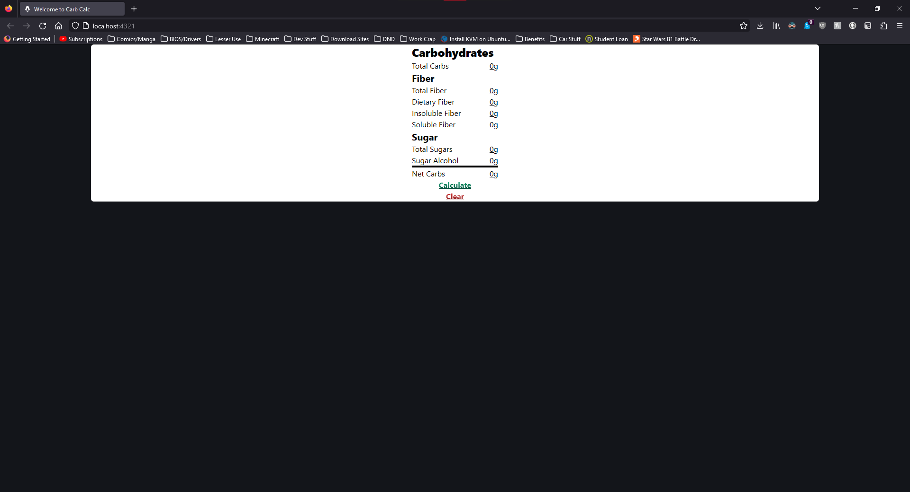

# Carb Calculator

## Usage

Click on any of the numbers above the ${\color{orange}separator}$ at the bottom and fill them with the corresponding info. Once all the info has been entered. Click on the ${\color{green}\bold{Calculate}}$ button. Otherwise if you want to clear all the numbers and start over, simply click the ${\color{red}\bold{Clear}}$ button.

## 🧞 Commands

All commands are run from the root of the project, from a terminal:

| Command                   | Action                                           |
| :------------------------ | :----------------------------------------------- |
| `npm install`             | Installs dependencies                            |
| `npm run dev`             | Starts local dev server at `localhost:4321`      |
| `npm run build`           | Build your production site to `./dist/`          |
| `npm run preview`         | Preview your build locally, before deploying     |
| `npm run astro ...`       | Run CLI commands like `astro add`, `astro check` |
| `npm run astro -- --help` | Get help using the Astro CLI                     |
